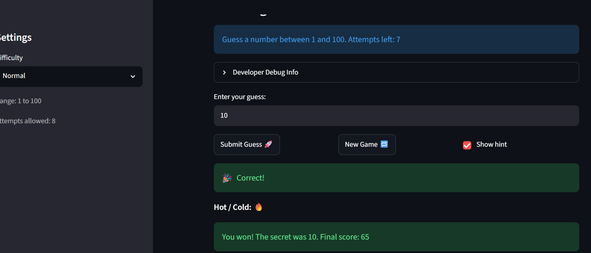

# 🎮 Game Glitch Investigator: The Impossible Guesser

## 🚨 The Situation

You asked an AI to build a simple "Number Guessing Game" using Streamlit.
It wrote the code, ran away, and now the game is unplayable. 

- You can't win.
- The hints lie to you.
- The secret number seems to have commitment issues.

## 🛠️ Setup

1. Install dependencies: `pip install -r requirements.txt`
2. Run the broken app: `python -m streamlit run app.py`

## 🕵️‍♂️ Your Mission

1. **Play the game.** Open the "Developer Debug Info" tab in the app to see the secret number. Try to win.
2. **Find the State Bug.** Why does the secret number change every time you click "Submit"? Ask ChatGPT: *"How do I keep a variable from resetting in Streamlit when I click a button?"*
3. **Fix the Logic.** The hints ("Higher/Lower") are wrong. Fix them.
4. **Refactor & Test.** - Move the logic into `logic_utils.py`.
   - Run `pytest` in your terminal.
   - Keep fixing until all tests pass!

## 📝 Document Your Experience

- [ ] Describe the game's purpose.
- [ ] Detail which bugs you found.
- [ ] Explain what fixes you applied.
The game is a number guessing game where you try to guess a secret number within a limited number of attempts based on the difficulty. Bugs I found included backwards hints, the new game button not working and attempts starting at 1 instead of 0. I fixed the hints by moving check_guess to logic_utils.py and swapping the messages from "Go Lower" to "Go Higher" and vice-versa, and fixed the button by resetting all state including score and status on new game.

## 📸 Demo Walkthrough

Describe your fixed game in numbered steps so a reader can follow along without watching a video:

1. User selects Normal difficulty (range 1-100, 8 attempts)
2. User enters a guess of 5 -> game returns "Too Low, Go HIGHER"
3. User enters a guess of 70 -> game returns "Too High, Go LOWER"
4. User enters a guess of 8 -> "Too Low, Go HIGHER"
5. User enters a guess of 10 -> "Correct!"
6. Game ends and shows final score
7. User clicks New Game -> score, history and text input all reset


**Screenshot** *(optional)*: <!-- Insert a screenshot of your fixed, winning game here -->

## 🧪 Test Results

```
# Paste your pytest output here, e.g.:
# pytest tests/
# ========================= X passed in 0.XXs =========================
```
 pytest
====================== test session starts =======================
platform win32 -- Python 3.13.7, pytest-9.0.3, pluggy-1.6.0
rootdir: C:\Users\ConneXionS\Downloads\project1\ai110-module1show-gameglitchinvestigator-starter
plugins: anyio-4.13.0
collected 4 items                                                 

tests\test_game_logic.py ....                               [100%]

======================= 4 passed in 0.05s ========================

## 🚀 Stretch Features

- [ ] [If you choose to complete Challenge 4, describe the Enhanced UI changes here — a screenshot is optional]

I added color-coded hints where "Too High" displays in red and "Too Low" displays in blue inorder to make the game more visually appealing. I also made the win display in green. I also added a Hot/Cold indicator that shows 🔥 when the guess is within 10 of the secret and 🧊 when the guess is far away. The check_guess function in logic_utils.py was updated to support the hot/cold logic by adding a new get_hot_cold_indicator function.
